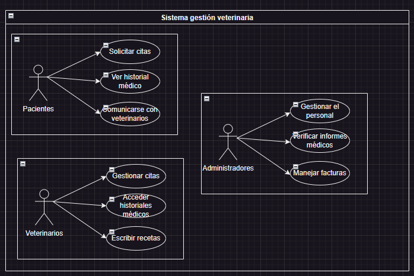

### Documentación de la Aplicación de la Gestión Veterinaria
---

#### Índice
- [Documentación de la Aplicación de la Gestión Veterinaria](#documentación-de-la-aplicación-de-la-gestión-veterinaria)
  - [Índice](#índice)
  - [Introducción](#introducción)
  - [Instalación](#instalación)
  - [Uso](#uso)
  - [Contribución](#contribución)
  - [Subvención](#subvención)

#### Introducción
El Sistema de Gestión Veteroma es desarrollado por el alumnado de **IES Miguel Herrero** permite gestionar animales. 

#### Instalación
Para instalar y configurar la aplicación en tu entorno local, sigue los siguientes pasos:
1. Clonar el repositorio desde GitHub:
   ```bash
   git clone https://github.com/haroxdev2/ex_reto_ed.git
   ```
2. Abre el proyecto en tu entorno.
3. Compila y ejecuta el proyecto.
#### Uso
El sistema veterinario incluye las siguientes funcionalidades:
- Solicitud y gestión de citas
- Acceso y consulta de historial clínico
- Comunicación entre pacientes y profesionales
- Gestion de recetas electronicas
- Administración del personal
- Revision de informes
- Gestion de facturas

Para utilizar la aplicación sigue las instrucciones proporcionadas en la interfaz de usuario o consulta la documentación del usuario incluida en el repositorio. 

A continuación se detalla la función dentro del sistema de cada uno de los usuarios:
| Usuario | Funcionalidad |
|---------|---------------|
| Paciente | Solicitar citas, accede a su historial, contacta con el médico|
| Veterinario | Gestiona citas, consulta historiales, emite recetas.|
| Administrador | Administra personal, informes y facturación|

Lo representamos a través del siguiente diagrama de casos de uso:


#### Contribución
¿Quieres colaborar en el desarrollo?
1. Haz un fork del repositorio.
2. Crea una nueva rama (`git checkout -b feature(tu-mejora).`)
3. Commit  (`git commit -am "Añadir una mejora (tu-mejora)"`)
4. Push a la rama (`git push origin feature(tu-mejora)`)
5. Abre pull request en GitHub.

#### Subvención
Este proyecto esta subvencionado por el [Gobierno de España](https://www.infosubvenciones.es/bdnstrans/GE/es/inicio).
***
Para obtener más información sobre la aplicación y su funcionamiento interno, consultas nuestra [documentación técnica](documentacion-tecnica.md).
Otros organismos colaboradores: 
